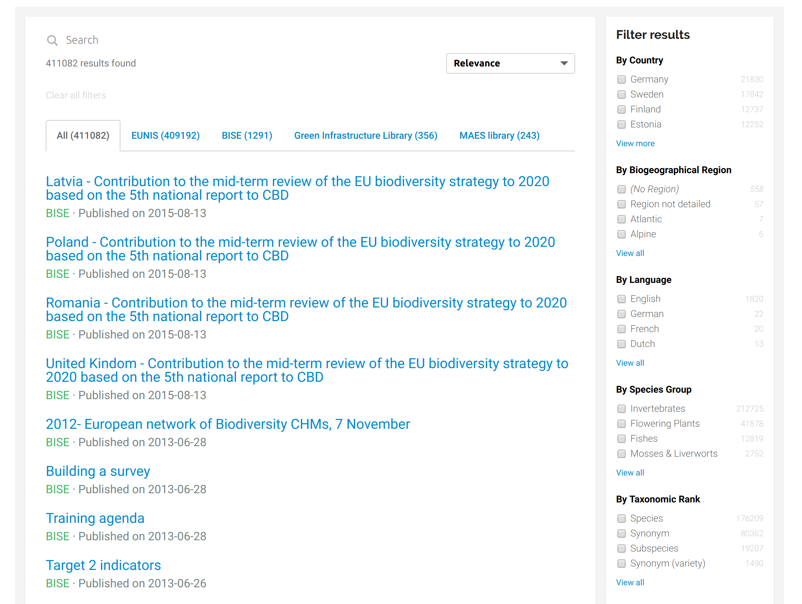
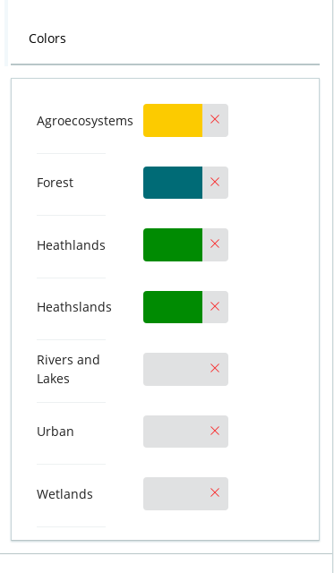
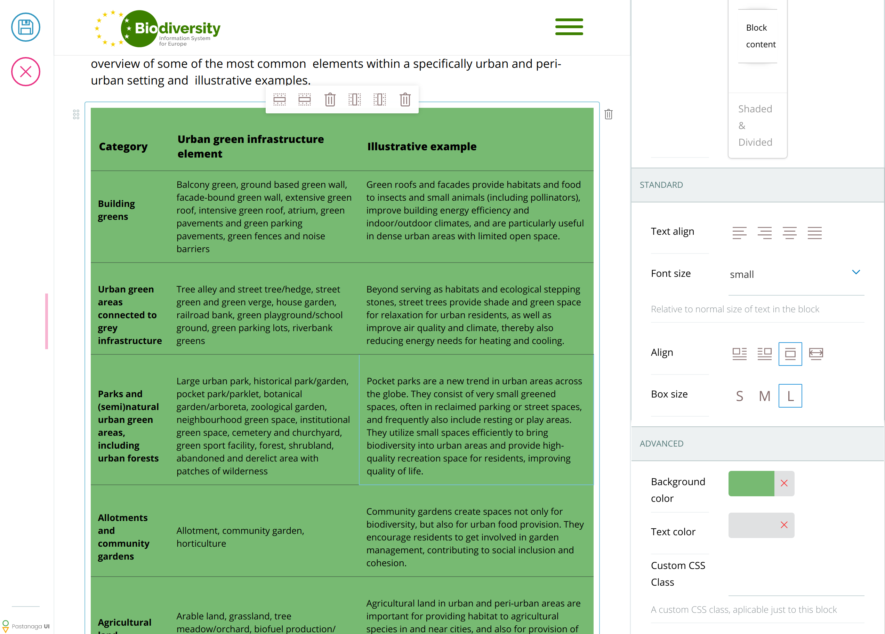

---
class:
  - invert
headingDivider: 2
theme: gaia
style: |
  section {
  }
  img {
    max-height: 80vh;
    max-width: 100%;
    text-align: center;
  }
---

# Volto block development patterns
<!-- _class: lead invert -->

#### Tiberiu Ichim
##### Eau de Web


<!--
I'm showcasing some patterns that we've identified while working with Volto.
You can already start using them today.
-->

# The power of Volto blocks

## volto-plotlycharts


<!--
I'll start with two interesting blocks that can instantly sell your product to
the client:

- volto-plotlycharts: hey, a chart editor in your block
-->


## volto-searchkit



<!--
- volto-searchkit: an ElasticSearch powered search engine as your block!
  - You know what I see when I look at this? It's code we don't write. It's
    about 6 or 700 lines of declarative React code.
    -->

## Context

- ZCA is still 110% greatness

<!--
We like to make fun of the ZCA, but we keep returning to it because it makes
building complex and pluggable systems humanly possible. Probably if the
multi-Plone database capabilities would be dropped the code would be simpler
and sure it can be less verbose, but who cares?

Sure, for the Plone veteran it's always clear what needs to be done: look in
the configure.zcml and you'll find a way to override things. But people that
haven't "internalized" the ZCA patterns it's not clear. And that's why
beginners find Volto easy: instead of having a generic hard concept to learn
first, they can take things gradually.

With Volto we can minimize the exposure to ZCA. And Volto allows non-Plone
people and other communities to contribute, even indirectly, to the Plone
success story.

-->

## Context

- ZCA is still 110% greatness
- We need configuration registries

<!--
In any case, Plone has multiple registries: global component registry, local
component registry, the configuration registry, etc. Volto has its own
configuration registry where things can be extended and overriden.

Now, there's no ZCA in Volto right now, although me and Alin were discussing,
at one point, the fact that we need some adapters. But to have adapters you
need to have types and concepts. We have types (Footer, Breadcrumb, etc) and
each block is its own type and we have some concepts (blocks, views, widgets)
that you can mostly find in Volto's config registry, but we don't really have
abstract concepts that we can say they bridge multiple concepts. I expect that
even when we'll introduce slot fills, using them would still be attached to
specific pieces of UI and not generic. UI is just different. In any case, Volto
is actually quite small, so the config registry is more like Django's, with the
singleton `settings.py` patern.

-->

## Context

- ZCA is still 110% greatness
- We need configuration registries
- Patterns make things extensible

<!--
The shadowing pattern in Volto is met with resistance and probably for good
reason. So to move forward we have to understand our patterns and build
a coherent extensibility story.
-->

# Types of patterns

<!-- _class: lead invert -->

<!--
What type of block patterns do we have?
-->


## Function-centered patterns

- **block variations**
  - default block values

<!--
  - block variations: a set of default values applied
    - ex: block quote / verse, etc
    - will be included in Volto core
-->

## Function-centered patterns

- **block variations**
  - default block values

- **block extensions**
  - templates from extensions

<!--
  - block extensions:
    - the listing block
    - will be included in Volto core
-->


## Function-centered patterns

- **block variations**
  - default block values

- **block extensions**
  - templates from extensions

- **block embedding**
  - [volto-blocks-form](https://github.com/eea/volto-blocks-form) FTW

<!--
  - block embedding: volto-blocks-form FTW
    - this is Volto's Form implementation (~2000 lines of code) split into
      reusable components.
    - The intention is to push this to volto core
    - hey, columns! grid-block, accordion, etc
-->

## ... Function-centered patterns

- **block transformations**
  - group, change block type

<!--
  - block transformations (mutate, group, etc)
    - go from columns -> accordion -> tabs
      - sure we can go build an uberblock that can be displayed in all 3 ways
      - but it's better to have a facility built into Volto that can
        generically transform between blocks (here's your adaptor pattern)
    - group blocks
    - we need a mechanism for this in Volto core
-->

## ... Function-centered patterns

- **block transformations**
  - group, change block type

- **director blocks**
  - manipulates other blocks

<!--
  - block creates another block
    - I'm probably the only guy that does it but it's something important
    - volto-slate would be just "slate", not "Volto" without this pattern
      - footnote
      - table block

Demo of slate copy/paste
-->

## ... Function-centered patterns

- **block transformations**
  - group, change block type

- **director blocks**
  - manipulates other blocks

- **presets of multiple blocks**
  - blocks as behavior

<!--
  - block presets
    - there's a long standing wish for "locally applied behaviors"
    - so I can imagine creating a pallette of "layouts" and being able to
      import multiple layouts in a single content page
-->

## Block development patterns

- **Client-side forms**
  - schemas allow extending and reusability

---
### Schema example

```jsx
export const TableSchema = () => ({
  title: 'Table',
  fieldsets: [
    {
      id: 'default',
      title: 'Default',
      fields: ['description'],
    },
  ],
  properties: {
    description: {
        title: 'Description',
        widget: 'textarea'
    }
  },
  required: ['title'],
});
```

<!--
We're reusing plone.restapi JSONSchemas.
-->

---
### Use the schema anywhere

```jsx
  <InlineForm
    schema={schema}
    title={schema.title}
    onChangeField={(id, value) => {
      onChangeBlock(block, {
        ...data,
        [id]: value,
      });
    }}
    formData={data}
  />
```
---
### Mutate the schema

- React = Reactivity
- Adjust the schema and the widgets will update

```js
const schema = TableSchema(props);
schema.properties.column.choices = csv_fields.map((n) => [n, n]);
```

---
### Everything is a widget

- **volto-object-widget**
  - Inline List Widget


---
### Everything is a widget

- **volto-object-widget**
  - Inline List Widget
  - Mapping widget (assign values to keys)



---
### Everything is a widget

- **volto-object-widget**
  - Inline List Widget
  - Mapping widget (assign values to keys)
  - Object by type (your choice of type of information)


---
### Compose behaviors

- Smaller components
- Reusable code
- Easier, better testing
- Code that is easier to maintain

```js
export default withBlockExtensions(withFileData(TableBlock));
```
<!-- we do this using HOCs -->

---
#### Higher order function

In mathematics and computer science, a higher-order
function is a function that does at least one of the following:

- takes one or more functions as arguments
  (i.e. procedural parameters),
- returns a function as its result.

@Wikipedia

---
#### HOC: function that wraps another component

Functional programming: composing functions

```
const add = (x, y) => x + y;

const addOne = (x) => add(x, 1);

const Footer = (props) => <div {...props}>footer stuff here<div>

const RedFooter = (props) => <Footer {...props} style={{background: 'red'}} />
```

```
function withRedBackground(WrappedComponent) {
  return (props) => <WrappedComponent {...props} style={{background: 'red'}} />
}
```

<!-- so HOCs are similar to Python decorators -->

---
#### HOC: fetch network resources HOCs

```
export const withFileData = (WrappedComponent) => {
  return (props) => {
    const dispatch = useDispatch();
    // pseudocode
    const request = useSelector((state) => state.content['@id']);
    const content = request?.data;

    React.useEffect(() => {
      if (path && !request?.loading && !request?.loaded && !content)
        dispatch(getRawContent(path));
    }, [dispatch, path, content, request?.loaded, request?.loading]);

    const file_data = React.useMemo(() => {
      if (content) {
        const res = csv.parse(content, { header: true });
        return res;
      }
    }, [content]);
    return <WrappedComponent file_data={file_data} {...props} />;
  };
};
```

---
#### HOC: extensible blocks

```
  // A HOC to inject a block extension by resolving the configured extension
  import React from 'react';
  import { blocks } from '~/config';

  export default (WrappedComponent) => (props) => {
    const { data } = props;
    const { block_extension } = data;
    const type = data['@type'];
    const extensions = blocks.blocksConfig[type].extensions || [];

    const index = extensions.findIndex(
      (conf) => conf.id === (block_extension || 'default'),
    );

    if (index === -1) {
      throw new Error(
        `You need to register the default extension for block types: ${type}`,
      );
    }

    const selectedExtension = extensions[index];

    return (
      <WrappedComponent
        {...props}
        extension={selectedExtension}
        extensions={extensions}
      />
    );
  };
```

### Blocks are extensible

- volto-block-style: the power of composition



---
### Recipe: block creates a block

The secret: `ReactDOM.unstable_batchedUpdates`

```jsx
  const id = uuid();
  const nb = {
    '@type': 'slateFootnotes',
    title: 'Footnotes',
  };
  const formData = {
    blocks: { ...blocks, [id]: nb },
    blocks_layout: {
      items: [...blocks_layout.items, id],
    },
  };
  ReactDOM.unstable_batchedUpdates(() => {
    onChangeField(blocksFieldname, formData[blocksFieldname]);
    onChangeField(
      blocksLayoutFieldname,
      formData[blocksLayoutFieldname],
    );
  });
```
---
### Recipe: reuse the blocks engine

Use [volto-blocks-form](https://github.com/eea/volto-blocks-form)

- volto-columns-block
- volto-block-accordion
- volto-grid-block
- volto-group-block

# Thank you!
#### Questions?
<!-- _class: lead invert -->

